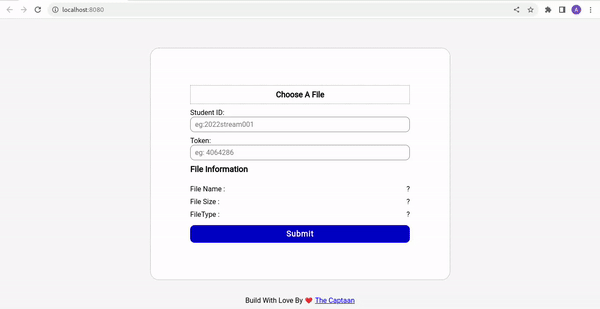

# File Upload NodeJS

  

## Setup Steps

    git clone https://github.com/thecaptaan/File-Upload-NodeJS.git
    cd File-Upload-NodeJS
    # create .env file and `SECRET_TOKEN = ""` && provide your secret token
    touch .env
    npm i

### Run For development

    npm run serve

### Run For Production

    npm i -g pm2
    pm2 node server.js

### To generate token

    # token is valid for only 5 minutes
    npm run token

### Libraries used in this project

- [alertify](https://alertifyjs.com/)
- [axios](https://www.npmjs.com/package/axios)
- [dotenv](https://www.npmjs.com/package/dotenv)
- [express js](https://expressjs.com/)
- [google fonts](https://fonts.google.com)
- [jsonwebtoken](https://www.npmjs.com/package/jsonwebtoken)
- [multer](https://www.npmjs.com/package/multer)
- [nanoid](https://www.npmjs.com/package/nanoid)
- [nodemon](https://www.npmjs.com/package/nodemon)
